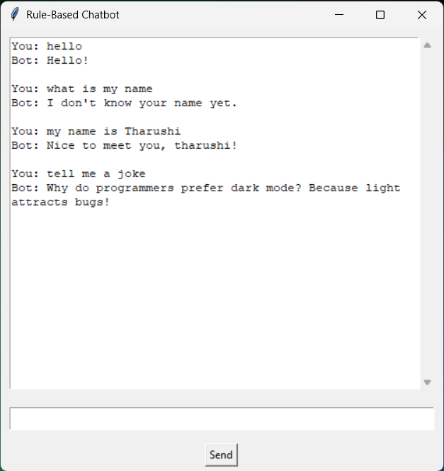

# Rule-Based Chatbot

A simple rule-based chatbot built using Python and keyword matching.

## Features

- Responds to greetings
- Handles simple conversations
- Uses JSON-based responses
- GUI chatbot using Tkinter
- Remembers user name
- Tells jokes and current time
- Beginner-friendly project structure

## Technologies Used

- Python
- JSON
- Tkinter
- Git & GitHub

## Project Structure

```text
rule-based-chatbot/
│
├── screenshots/
│   └── chatbot-screenshot.png
│
├── chatbot.py
├── gui_chatbot.py
├── responses.json
├── requirements.txt
└── README.md
```

## How to Run

1. Clone the repository

```bash
git clone https://github.com/Avish-Tharu/rule-based-chatbot.git
```

2. Open project folder

```bash
cd rule-based-chatbot
```

3. Run terminal chatbot

```bash
python chatbot.py
```

4. Run GUI chatbot

```bash
python gui_chatbot.py
```

## Example Inputs

```text
hello
tell me a joke
my name is Tharushi
what is my name
time
bye
```

## GUI Preview



## Future Improvements

- Add NLP features
- Add voice assistant support
- Improve chatbot intelligence
- Add chatbot themes
